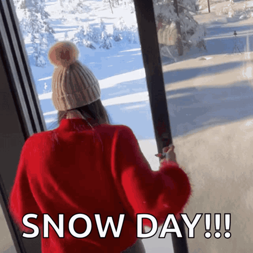

#  entrenamiento

| patrón | significado    |
| ------ | -------------- |
| `\d`   | Dígito         |
| `\D`   | No Dígito      |
| `\w`   | Letra o número |
| `+`    | Uno o más      |
| `*`    | cero o más     |